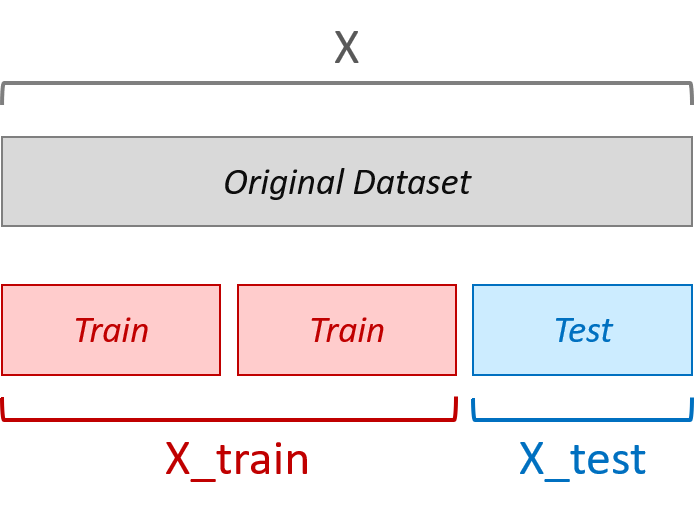

# Démo : Entrainer un modèle de classification en machine learning

## 1. Importer les données

Nous utilisons la librairie **pandas** de Python pour présenter les données en format **DataFrame**.


```python
import pandas as pd
```

Les données sont disponibles dans le fichier `colon_cancer.csv`. L'import de données se fait avec la commande `read_csv` de pandas. L'attribut `shape` contient les dimensions de la matrice de données (dataframe).


```python
data = pd.read_csv('../data/colon_cancer.csv', sep=';', index_col='id_sample')
print('data', data.shape)
```

La méthode `head()` permet d'afficher 5 premières lignes du dataframe. Si nécessaire, on peut présiser le nombre de lignes à afficher, par exemple `head(3)` pour 3 lignes.  


```python
data.head()
```

Les types de données de chaque colonne peuvent être affichés avec `dtypes`. 


```python
data.dtypes
```

La méthode `describe` affiche des statistiques descriptives des données numériques. La colonne `tissue_status` ne sera pas inscluse.


```python
data.describe()
```

## 2. Afficher la distribution des valeurs d'expression

Les librairies **matplotlib** et **seaborn** servent à créer des graphiques.


```python
%matplotlib inline
import seaborn as sns
import matplotlib.pyplot as plt
```

La commande `displot` permet d'afficher une distribution (par exemple, kernel density estimator *kde* ou histogramme *hist*).


```python
selected_gene = 'DAO'
selected_features = [selected_gene, 'tissue_status']
sns.displot(data=data[selected_features], x=selected_gene, hue='tissue_status', kind='kde')
```

## 3. Créer la matrice de données (avec les features) et le vecteur des cibles (targets)

La matrice de données utilisée en apprentissage est nommé par convention **X** en majuscule. Dans cet exemple, **X** contient les données d'un seul gène.


```python
selected_features = [selected_gene]
X = data[selected_features]
X.head(3)
```

Les cibles (targets) sont représentées par un vecteur (*list*, *numpy.array* ou *pandas.Series*), nommé par convention **y** en minuscule.


```python
y = data['tissue_status']
print(y)
```

## 4. Créer un dataset d'entrainement et un dataset de test

Dans une approche de machine learning, il est obligatoire de partager le dataset initial **X** en deux datatsets : un dataset qui servira à entrainer le modèle **X_train** et un autre pour tester le modèle obtenu **X_test**. Les échantillons sont tirés au hasard.



La librairie de **scikit-learn** contient un outil `train_test_split` pour créer facilement ces datasets.  


```python
from sklearn.model_selection import train_test_split

X_train, X_test, y_train, y_test = train_test_split(X, y, test_size=1/3, random_state=42, stratify=y)
print('Train dataset:', X_train.shape, 'Test dataset:', X_test.shape)
X_train.head(3)
```

## 5. Entrainer un arbre de décisison (Decision Tree) 

Un arbre de décision cherche un seuil optimal qui permet de séparer les échantillons normaux et tumoraux. L'option *max_depth* indique la profondeur maximale de l'arbre. La méthode `fit` effectue l'entrainement du modèle. Bien entendu, l'entrainement du modèle se fait uniquement sur le dataset d'entrainement **X_train**.


```python
from sklearn.tree import DecisionTreeClassifier
classifier = DecisionTreeClassifier(max_depth=1, random_state=42, criterion='entropy')
classifier.fit(X_train, y_train)
```

Il est possible d'afficher le seuil de décision obtenu par l'entrainement avec la fonction `export_text`.


```python
from sklearn.tree import export_text, plot_tree
decision_tree_text = export_text(classifier, feature_names=list(X_train.columns))
print(decision_tree_text)
```

On peut également visualiser l'arbre de décision quand il n'est pas trop complexe. La fonction `plot_tree` génère le graphique.


```python
plot_tree(classifier, feature_names=list(X_train.columns),  class_names=y.unique(), precision=2, filled=True)
```

## 6. Prédire le diagnostic des nouveaux patients (dataset de test)

Une fois le modèle entrainé, il peut être utilisé sur de nouveaux échantillons pour prédire leur status (normal ou tumoral). La performance du modèle est habituellement estimée par une métrique. Dans notre exemple, on utilise la métrique *accuracy* (justesse).

**Accuracy** = Nombre de prédictions correctes / Nombre total de prédictions

La prédiction se fait avec la méthode `predict`. Les modèles d'apprentissage supervisés dans **scikit-learn** possèdent les méthodes standards `fit` et `predict`.


```python
from sklearn import metrics
y_pred_train = classifier.predict(X_train)
y_pred_test = classifier.predict(X_test)
accuracy_train = metrics.accuracy_score(y_train, y_pred_train)
accuracy_test = metrics.accuracy_score(y_test, y_pred_test)
print('Train accuracy:', '{:.2f}'.format(accuracy_train), 'Test accuracy:', '{:.2f}'.format(accuracy_test))
```

Pour évaluer un modèle on prend surtout en compte la métrique calculée sur **le dataset de test**. Parfois on peut la comparer avec la métrique obtenue sur le dataset d'entrainement pour savoir si le modèle a tendance à surapprendre.  

## 7. Créer une fonction pour automatiser le calcul de la métrique 

Par la suite, nous allons souvent réaliser les étapes d'entrainement, de  prédiction et de calcul de la métrique pour différents modèles de machine learning. Il serait plus pratique de créer une fonction `calculate_accuracy`.


```python
def calculate_accuracy(classifier, X_train, X_test, y_train, y_test):
    classifier.fit(X_train, y_train)
    y_pred_train = classifier.predict(X_train)
    y_pred_test = classifier.predict(X_test)
    accuracy_train = metrics.accuracy_score(y_train, y_pred_train)
    accuracy_test = metrics.accuracy_score(y_test, y_pred_test)
    print('Train accuracy:', '{:.2f}'.format(accuracy_train), 'Test accuracy:', '{:.2f}'.format(accuracy_test))
    return accuracy_train, accuracy_test, classifier
```


```python
accuracy_train, accuracy_test, trained_classifier = calculate_accuracy(classifier, X_train, X_test, y_train, y_test)
```
